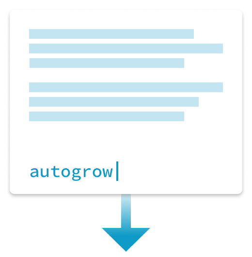

<div style="text-align:center">
  <a href="https://carlrafting.com/autogrow">
    
  </a>
</div>

## Table of Contents

- [What is autogrow?](#what-is-autogrow)
- [New in Version 2](#new-in-version-2)
- [How to Use autogrow](#how-to-use-autogrow)
- [API](#api)
  - `autogrow(target, options)`
  - `autogrow.all()`
  - `autogrow.init()`

## What is autogrow?

autogrow consists two files. One CSS file and one JavaScript file. autogrows purpose is to make `textarea`s on the web, more elegant and less frustrating to use.

It does this by expanding the height of the `textarea`, depending on the amount of content it contains. This solves the problem of having to scroll inside the textarea, which can be a frustrating experience, especially on mobile devices.

You can read more in the article [Expanding Text Areas Made Elegant](http://www.alistapart.com/articles/expanding-text-areas-made-elegant/) by _Neil Jenkins_, where some of the code is adapted from.

## New in Version 2

Here's an overview of noteworthy changes in version 2.

* Accepts `HTMLTextAreaElement` as `target` argument to `autogrow()`. Doesn't need to be attached to the DOM.
* Creates DOM Elements with `document.createElement()` instead of setting string values on `Element.innerHTML`
* It's now possible to use `autogrow()` for targeting individual elements.
* `autogrow.init()` is now alias for `autogrow.all()`. Makes it possible to upgrade from previous versions without breaking.
* Makes use of a `DocumentFragment` for better performance.

## How to Use autogrow

Using autogrow is simple. Simply call `autogrow()` by providing the element to select as the first argument.

```js
// get element by id
autogrow('textarea');

// get element with id selector
autogrow('#textarea');

// get element with class selector
autogrow('.textarea');

// get element by id and provide custom styling options
autogrow('textarea', {
  areaClass: 'my-area-class',
  containerClass: 'my-container-class',
  mirrorClass: 'my-mirror-class',
  spanClass: 'my-span-class'
});

// create textarea and run it through autogrow
var textarea = document.createElement('textarea');
var ret = autogrow(textarea);
// append results to DOM
document.body.appendChild(ret.container);
```

## API

### `autogrow(target, options)`

#### Arguments

* `target`, type: `String`|`HTMLTextAreaElement`, element in DOM to get or element to transform. If `target` is `HTMLTextAreaElement`, it's not necessary for element to already exist in DOM.
* `options`, type: `Object`, accepts following properties:
```js
{
    areaClass: String, // class to apply to textarea
    containerClass: String, // class for autogrow container
    mirrorClass: String, // class for mirror element
    spanClass: String // class for span element
}
```

#### Return Value

type: `Object`, with elements generated by autogrow

```js
{
  container: HTMLDivElement,
  mirror: HTMLPreElement,
  span: HTMLSpanElement,
  target: HTMLTextareaElement|String,
  element: HTMLTextareaElement
}
```

#### Description

Here's the html that's generated when `autogrow('autogrow')` is called.

Before:
```html
<textarea id="autogrow"></textarea>
```

After:
```html
<div class="autogrow">
  <pre class="autogrow-mirror">
    <span class="autogrow-mirror-span"></span>
    <br>
  </pre>
  <textarea id="autogrow" class="autogrow-area"></textarea>
</div>
```

### `autogrow.all()`

#### Arguments

None

#### Return Value

None

#### Description

Gets all `textarea` elements from DOM and runs `autogrow()` on each element. Sets an id on element if it doesn't already have it.

### `autogrow.init()`

#### Arguments

None

#### Return Value

None

#### Description

Alias for `autogrow.all()`.

Behaves similarly to previous versions of autogrow.
